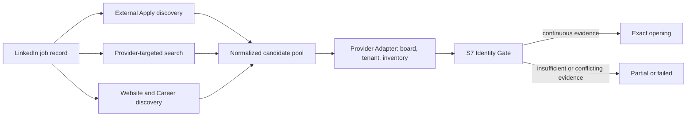

# AI Job Source Agent

[](https://github.com/yinh2025s/ai-job-source-agent/actions/workflows/ci.yml)

AI Job Source Agent is a deterministic Beta backend that starts from a LinkedIn
job record and looks for the corresponding opening on the employer's official
hiring system. It combines three candidate-discovery routes, validates supported
ATS inventories, and publishes an opening only after the S7 identity gate confirms
company, hiring entity, provider, tenant, title, location, and opening continuity.

Current adapter version: **`2026-07-29.286`**. The release runtime is
**CPython 3.12**.

This is a precision-first Beta, not a claim of complete web coverage. When the
evidence chain is incomplete, the backend returns a structured partial or failed
result instead of guessing a URL.

## Run It

From the repository root:

```bash
make beta-demo PYTHON=python3.12
```

This needs no network and writes:

- `/tmp/ai-job-source-agent-beta-demo/results.json`
- `/tmp/ai-job-source-agent-beta-demo/trace.json`

For an installed command, optionally create a virtual environment and install
the project:

```bash
python3.12 -m venv .venv
source .venv/bin/activate
python -m pip install --upgrade pip setuptools
python -m pip install -e .
ai-job-source-agent --help
```

`python -m job_source_agent` is an equivalent source-checkout entry point.

The command is deterministic and uses only checked-in fixtures. It produces:

- `results.json`: concise product results.
- `trace.json`: stage decisions, evidence, candidate attribution, and rejection
  reasons.

Current terminal output:

```text
OK Aurora Data
  linkedin job: AI Algorithm Engineer Intern
  website: https://aurora-data.example
  career: https://jobs.lever.co/aurora-data
  job list: https://jobs.lever.co/aurora-data
  opening: https://jobs.lever.co/aurora-data/d9d64766-3d42-4ba9-94d4-f74cdaf20065
FAIL Nimbus Robotics
  linkedin job: Machine Learning Engineer Intern
  website: https://nimbus-robotics.example
  career: https://nimbus-robotics.example/careers
  job list: https://nimbus-robotics.example/careers
  opening: None
  error: result_identity_mismatch
```

The `.example` domains above are deliberately local demo identities. They prove
the pipeline and safety contracts without presenting the fixture run as live-web
accuracy. Aurora demonstrates a verified Exact; Nimbus deliberately demonstrates
that S7 withholds a plausible-looking opening when identity continuity fails.

## Input And Output

The backend accepts a JSON array. A real extracted record may include an
authenticated browser-observed External Apply URL, but that URL remains an
untrusted candidate until the backend verifies it.

```json
[
  {
    "linkedin_job_url": "https://www.linkedin.com/jobs/view/1234567890",
    "external_apply_url": "https://jobs.example-ats.com/acme/jobs/abc123",
    "company_name": "Acme",
    "company_website_url": "https://www.acme.example",
    "job_title": "Machine Learning Engineer",
    "job_location": "New York, NY",
    "source": "linkedin_browser_extension"
  }
]
```

A successful result has the same source identity plus the verified navigation
chain and seven structured stage results:

```json
{
  "company_name": "Acme",
  "linkedin_job_title": "Machine Learning Engineer",
  "linkedin_job_location": "New York, NY",
  "company_website_url": "https://www.acme.example",
  "career_page_url": "https://jobs.example-ats.com/acme",
  "job_list_page_url": "https://jobs.example-ats.com/acme",
  "open_position_url": "https://jobs.example-ats.com/acme/jobs/abc123",
  "pipeline_status": "success",
  "error_code": null,
  "output_validation_status": "success",
  "stages": ["seven structured stage records"]
}
```

Consumers should use `pipeline_status`, `error_code`, `stages`, and
`identity_assertion`; the older `status` and `error` fields remain for demo
compatibility.

## Architecture



The three routes improve recall, but none can declare success:

1. **External Apply** reads a supplied Apply target, unwraps safe LinkedIn
   redirects, and treats the target as a lead.
2. **Provider search** issues bounded ATS-targeted searches for likely boards or
   openings.
3. **Website/Career exploration** follows first-party pages and explicit ATS
   handoffs.

The candidate pool normalizes, deduplicates, identifies providers, ranks by
evidence strength, and limits work. The Provider Registry currently discovers
48 native adapter modules, including Workday, Greenhouse, Lever, Ashby, iCIMS,
SuccessFactors, Oracle HCM, SmartRecruiters, Workable, GovernmentJobs, and other
common hosted systems. An adapter name means that a provider contract exists;
it does not guarantee that every tenant, private inventory, login wall, or
JavaScript presentation can be read anonymously.

S7 is the final publication boundary. A high title similarity or a search-result
snippet is never enough by itself.

## Live Use

To discover a small public LinkedIn cohort and run the complete backend:

```bash
python3.12 -m job_source_agent \
  --linkedin-keywords "AI Engineer" \
  --linkedin-location "United States" \
  --linkedin-pages 1 \
  --limit 3 \
  --fetch-timeout 8 \
  --output linkedin-results.json \
  --trace-output linkedin-trace.json
```

Or replace `samples/linkedin_jobs.json` in the first command with an extracted
JSON file and omit `--fixtures-dir` and `--offline`. The default `stage_v1`
scheduler enables the three candidate routes. The proposed `coordinator_v2`
engine is not part of this Beta acceptance path.

Live results vary with public LinkedIn HTML, DNS, rate limits, bot protection,
JavaScript rendering, login walls, and employer inventory changes. Keep live
runs small and inspect `trace.json`; do not treat a transient fetch failure as
proof that an opening does not exist.

For JavaScript-heavy public pages, install the optional renderer:

```bash
python -m pip install -e ".[browser]"
playwright install chromium
```

Then add `--render-js --render-budget 3`. The browser fallback is bounded and
does not weaken provider or identity verification.

## Result Semantics

The pipeline is fail-closed:

- **Exact opening**: S7 accepted a continuous company-to-opening evidence chain.
- **Verified not found**: a verified official inventory was read completely and
  did not contain the requested role, or evidence shows no public openings.
- **External blocked**: a verified first-party/provider route is persistently
  inaccessible; a single timeout is not sufficient.
- **Input identity invalid / identity rejected**: company, brand, hiring entity,
  provider tenant, title, or location continuity conflicts.
- **Partial / retryable failure**: an official Website, Career page, or Job List
  may be known, but the evidence is insufficient for an Exact opening.

`open_position_url` remains `null` unless the final gate succeeds. A partial Job
List is useful navigation evidence, but it is not reported as an Exact opening.

## Measured Results

These cohorts are development evidence, not promises for arbitrary companies:

| Cohort | Version | Trustworthy result | Important limitation |
| --- | --- | --- | --- |
| Frozen100 | `.188` | 69 Exact; 69/69 evidence-eligible Exact; 100/100 replay; zero audited wrong URL, location, company, or tenant | A repeatedly developed and manually closed cohort; not an unseen generalization estimate |
| Fresh100 cold | `.283` | 92 Websites, 79 Career pages, 71 verified Job Lists, 36 raw Exact; zero serialized wrong URL, location, company, or tenant | 34 Exact were artifact-clean, two had provisional identity, replay was 99/100, and missing terminal labels make formal precision and eligible recall unreportable |
| Current code | `.286` | Preserves the S7 safety boundary and adds typed candidate-route evidence | No newer full Fresh100 measurement; the authoritative Fresh100 score remains `.283` at 36/100 raw Exact |

The honest Beta conclusion is therefore: published URLs are guarded
conservatively, while recall on unfamiliar public-web inputs remains limited.
See the [Frozen100 final report](docs/FROZEN_100_FINAL_REPORT.md),
[Fresh100 `.283` report](docs/FRESH_100_V283_CURRENT_COLD_GATE_REPORT.md), and
[current closure matrix](docs/FRESH_100_CURRENT_CLOSURE_MATRIX.md).

## Troubleshooting

**`python3.12: command not found`**

Install CPython 3.12 and recreate the virtual environment. Python 3.14 is not a
release runtime for this repository because long live batches reproduced native
crashes there. The package metadata accepts 3.10-3.13, but release evidence is
pinned to 3.12.

**Editable installation cannot find `setuptools`**

The one-command offline demo does not require installation. For the optional
console entry point, connect to the package index and run
`python -m pip install --upgrade pip setuptools` before `pip install -e .`.

**The offline demo tries to access the network**

Run from the repository root and include all three flags:
`--fixtures-dir samples/sites --offline --input samples/linkedin_jobs.json`.

**`open_position_url` is `null`**

Inspect `error_code`, the seven `stages`, and `trace.json`. This is expected when
the backend has only a Career/Job List, cannot read complete inventory, sees an
identity conflict, or exhausts a retryable network budget.

**A JavaScript page is empty or returns a shell**

Install the browser extra and use bounded `--render-js`. Login-protected or
bot-blocked inventory may still remain unavailable and should not be bypassed or
reclassified as verified absence.

**A checkpoint cannot resume**

Checkpoints are bound to adapter version and run configuration. Use a new
`--checkpoint-dir`, or intentionally restart from a compatible stage with
`--resume-from-stage` / `--rerun-stage`. Do not mix checkpoints across versions.

**A live trace contains page data or credential-shaped text**

Do not commit or send raw live artifacts. Release packaging must exclude caches,
checkpoints, cookies, authenticated HTML, snapshots, and unsanitized traces.

## Demo And Review

- [3-5 minute Beta demo script](docs/BETA_DEMO_SCRIPT.md)
- [Seven-record demo evidence and acceptance boundary](docs/BETA_DEMO_EVIDENCE.md)
- [Beta project summary](docs/BETA_PROJECT_SUMMARY.md)
- [Message to Li Kai](docs/LI_KAI_MESSAGE.md)
- [Architecture](docs/ARCHITECTURE.md)
- [Implementation plan](IMPLEMENTATION_PLAN.md)
- [Development governance](DEVELOPMENT_GOVERNANCE.md)
- [Changelog](CHANGELOG.md)

The seven-record `samples/beta_demo_input.json` is curated demonstration input,
not a generalization benchmark. Its `.286` focused live run completed 7/7 and
produced three identity-audited Exact openings plus conservative non-success
terminals. The full focused replay bundle did not pass record integrity, so use
the deterministic offline fixtures for the live presentation and read the
evidence document for the exact current boundary.

## Development Gates

The focused local checks are:

```bash
make offline-gates PYTHON=python3.12
git diff --check
```

Network benchmarks, authenticated LinkedIn extension acceptance, and sealed
holdouts are separate serial gates. They are not required to run the deterministic
offline demo and are not replaced by fixtures.

## Beta Boundary

This delivery freezes provider and discovery behavior at `.286`. Known work for
a future iteration includes higher recall on unfamiliar company identities,
better anonymous access to dynamic inventories, authenticated External Apply
input parity, and a separately measured scheduler redesign. Those are explicitly
outside this Beta handoff; the current product favors traceable refusal over an
unverified answer.
